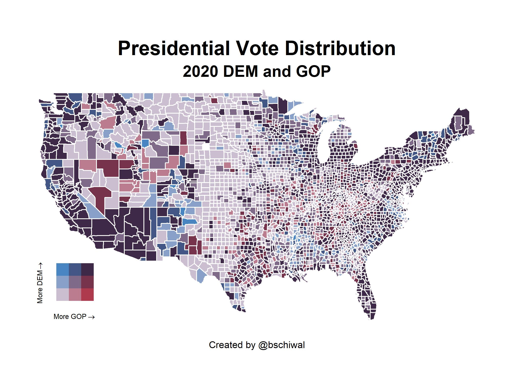

# ElectionExploration
Using Election Data to learn more about R and R Studio

I am starting this project both to learn more about R studio, Dyplyr and other
statistical coding that I need practice with, but also to learn how to publish
what I am working on in GitHub. This is the first project to a hopefully varying
future portfolio. 

in 'PresidentialResults08-20.R' I am testing various ways at analyzing county data in the past presidential elections. 

MappingTest.R is a test project I found to help me learn how to generate maps in R.

